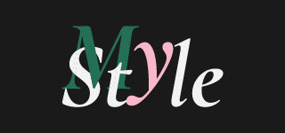

# My Style

Todos tenemos estilos diferentes; algunos prefieren estilos atrevidos, otros un poco más serios, pero esto no quiere decir que no coincidamos en algunos gustos en cuanto a prendas o accesorios.

A veces se vuelve tedioso pensar -"¿Qué me voy a poner ahora?" sobre todo cuando tienes que vestirte "diferente" para el trabajo o la escuela todos los días, también es muy abrumador pensar -"No tengo nada para la fiesta" o -"¿El color de esta falda combinara con mi blusa?". También sabemos que no simpre tenemos el dinero suficiente para comprar ropa nueva.

También debemos pensar que el consumo descontrolado en tiendas de fast fashion trae graves concecuencias a nuestro planeta.

A pesar de nuestras diferencias en cuanto a manera de vestir, es mucho más fácil cuando tus amigos, personas conocidas o incluso personas a las que admiras te sirven de inspiración. Por otra parte, sería increible hacer un trueque con ese famoso que tanto admiras ¿no? y que tu conciencia este tranquila.

Por eso My Style llegó para ayudarte en esta tarea tan común pero también complicada en algunas ocaciones.

## Definición del producto

Con My Style estrás al tanto de las últimas tendencias, también tus amigos, conocidos y famosos serán tus inspiración, podrás hacer trueques con tu red de amigos sin gastar un solo peso. Además My Style te ayudará en la búsqueda de la persona qué te facilitará la prenda que tanto andabas buscando.

Todo esto con la ventaja de que estrás tranquilo por no contaminar más a este planeta.

## Elementos gráficos

### Paleta de color

Negro: #1a1a1a

Rosa: #f8b8c9

Verde oscuro: #247056

Verde claro : #c1ddbf

Naranja: #f35d2e

Gris: #f2f2f2

### Tipografía

Cormorant para títulos y textos de mayor importancia.

Gothic A1 para párrafos y textos secundarios.
